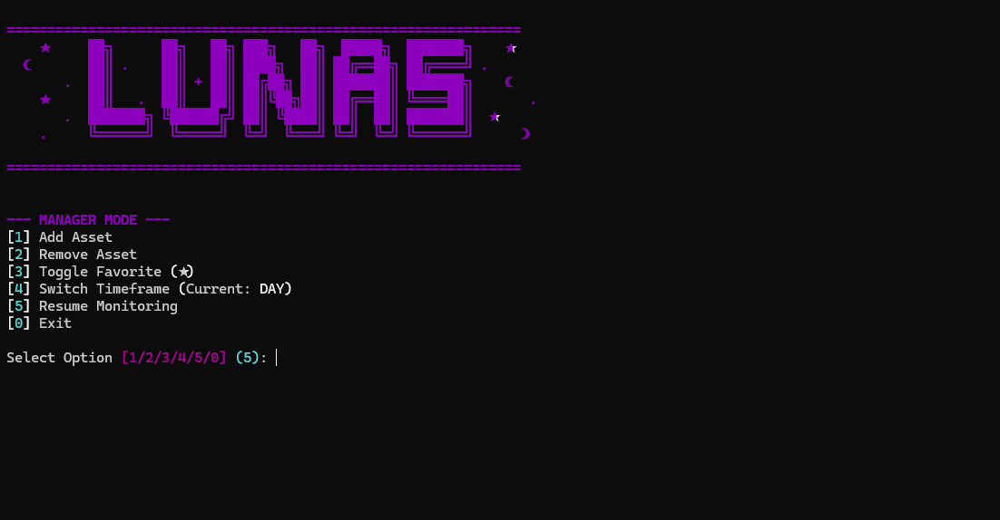

<div align="center">

# 📈 L U N A S   M A R K E T
### Institutional Grade Real-Time Asset Tracker


<br>

A powerful, aesthetic CLI Dashboard for monitoring Stocks, Crypto, and Forex in real-time.
Built with Python, utilizing `Rich` for the UI and `Yfinance` for institutional-grade data.

</div>

---

## ⚡ Overview

**Lunas Market** is a terminal-based financial dashboard designed for traders and developers who prefer the command line over bloated web interfaces. 

It provides real-time price updates, visual trend indicators, and technical analysis (RSI) in a clean, cyberpunk-styled interface. It runs continuously as a background monitor and includes a built-in manager to handle your portfolio on the fly.

---

## ✨ Key Features

* **📊 Smart Asset Recognition:** Automatically detects and displays icons for Crypto (🪙), Stocks (🏢), and Forex (💱).
* **📡 Real-Time Data:** Fetches live market data via Yahoo Finance API with auto-refresh (default: 5 min).
* **📉 Technical Analysis:** Built-in **RSI (Relative Strength Index)** algorithm to detect Overbought/Oversold conditions.
* **📏 Visual Range Bars:** Dynamic visual bars showing exactly where the current price sits between the High and Low of the selected timeframe.
* **⏱ Multi-Timeframe:** Switch between Daily, Weekly, and Monthly ranges to analyze volatility.
* **⭐ Favorites System:** Pin your top assets to the top of the list with a simple toggle.
* **🎨 Cyberpunk UI:** Fully styled with the `Rich` library for a modern, dark-mode experience.

---

## 📸 Screenshots

<div align="center">
  
  
</div>

---

## 🚀 Installation

### Prerequisites
* Python 3.8+
* Internet connection

### 1. Clone the Repository
```bash
git clone [https://github.com/Gabri258064/Lunas_Market.git](https://github.com/Gabri258064/Lunas_Market.git)
cd Lunas_Market
2. Install Dependencies
Bash
pip install -r requirements.txt
3. Run the Dashboard
Bash
python market_watcher.py
🎮 Controls & Usage
Once the dashboard is running, it will update automatically. To access the Manager Menu, do not close the window.

CTRL + C : Interrupt the loop to open the Manager Menu.

Manager Menu Options:
Add Asset: Type any valid ticker symbol (e.g., NVDA, BTC-USD, EURUSD=X).

Remove Asset: Remove an item from your watchlist.

Toggle Favorite (★): Pin an asset to the top of the list.

Switch Timeframe: Cycle between DAY, WEEK, and MONTH range visualization.

Resume: Go back to the live dashboard.
```
🛠 Configuration
The tool automatically creates a market_config.json file on the first run. You can manually edit this file to configure your default watchlist or refresh interval.

JSON
{
    "assets": ["BTC-USD", "ETH-USD", "NVDA", "TSLA"],
    "favorites": ["BTC-USD"],
    "timeframe": "DAY"
}
⚠️ Disclaimer
This tool is for informational purposes only. It does not constitute financial advice. The RSI and Range indicators are mathematical calculations based on historical data. Always do your own research before trading.

📄 License
This project is licensed under the MIT License - see the LICENSE file for details.

<div align="center"> Created with 💜 by <b>Gabri2580 & Project Lunas</b> </div>
